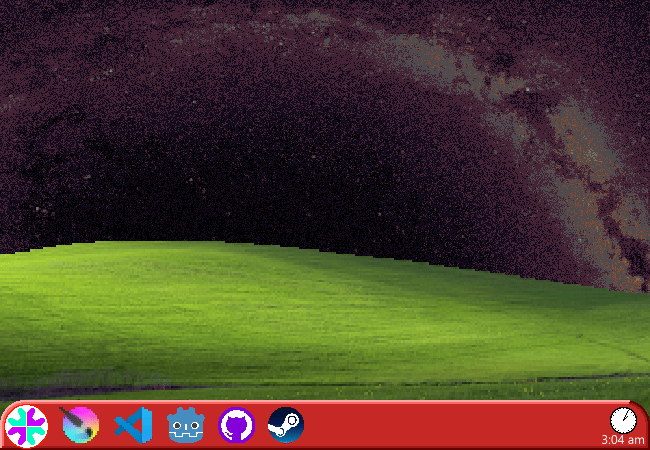

			<h1>==></h1>
			
			
You brave through the 10 second headache and are met with your computer's DESKTOP. The wallpaper is that one old BLISS image but the sky has been painstakingly edited by you to have a modified image of the MILKYWAY you found on the INTERNET.

			
You suppose you'll look over your INTERESTS before doing anything else, making a great effort to TOTALLY not copy some SMALL, VERY UNINFLUENTIAL WEBCOMIC you saw one time in passing that did NOT completely re-define the INTERNET, and your BRAIN, as you know it...

			
You like: GAMING, GENERAL CREATION, although more specifically: PROGRAMMING(sometimes), DRAWING(Every so often), IMAGE/VIDEO EDITING(Not all the time). Also like, MODDING THINGS but that usually falls under the other 3 I just mentioned. And A FEW OTHER STUFF as well...

			
Your task bar is full of COPYRIGHTED MATERIAL and you will not open any of them anyway.

			
I'm not very good at writing characters so this'll basically be a self insert until I actually have a good character who's INTERESTS I can put here. I mean the description is also vague enough to be a very common personality for many people but whatever.

			<a href="?p=0006"><h2>> Open browser</h2><a>
		