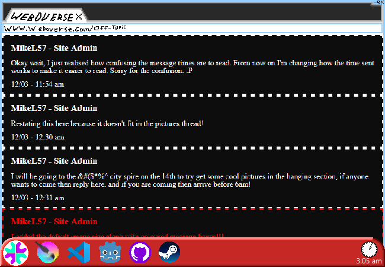

			<h1>Click on Off-Topic thread</h1>
			
			
(From now on, if there's any sort of long message thing then it'll display as a collapsible object with text and a triangle next to it. Click on the text or triangle to expand it. In this case it's the "Open Forum" text below the first paragraph.)

			
You click on the Off-Topic thread and start reading, remembering that these forum posts don't all happen at once and if something seems weird then you'll check the time it's been posted. Well, it doesn't really matter but stuff will be out of order sometimes.

			

				
Open Forum Thread

				

					

					<h3>MikeL57 - Site Admin</h3>
					
Okay wait, I just realised how confusing the message times are to read. From now on I'm changing how the time sent works to make it easier to read. Sorry for the confusion. :P

					
12/03 - 11:54 am

					

					

					<h3>MikeL57 - Site Admin</h3>
					
Restating this here because it doesn't fit in the pictures thread:

					
12/03 - 12:30 am

					

					

					<h3>MikeL57 - Site Admin</h3>
					
I will be going to the &#@$*%^ city spire on the 14th to try get some cool pictures in the hanging section, if anyone wants to come then reply here. and if you are coming then arrive before 6am!

					
12/03 - 12:31 am

					

					

					<h3>MikeL57 - Site Admin</h3>
					
I added the default image size along with coloured message boxes!!!

					
13/03 - 06:23 pm

					

				

			

			
Hmmm, not much... Makes sense because it's the off-topic updates thread, but that part before the coloured message seems interesting? You wonder what the context behind it is. Maybe you could go look for the original message in the thread mentioned? Although you would like to read the discussion thread first, just to see if there's anything new there.

			<a href="?p=0011"><h2>> Find Funky Message's Source</h2><a>
		