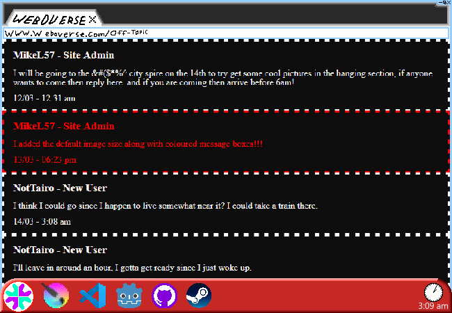

			<h1>never ever put anything other than pyjamas on [sic]</h1>
			
			
Well ok, you're the boss I guess.

			
"Ok but John quantanimo bay trials should send the message even though he has not changed" [also sic]

			
This isn't the QT guy but okay. They, as in you, send a message, to, the, thread,, to,, tell,, them,,, that,,, you're,,,, going,,,,,

			
,,,,,,,,,,,,,,,,,,,,,,,,,,,,,,,,

			

				
Show new messages

				

					

						<h3>NotTairo - New User</h3>
						
I think I could go since I happen to live somewhat near it? I could take a train there.

						
14/03 - 3:08 am

					

					

						<h3>NotTairo - New User</h3>
						
I'll leave in around an hour, I gotta get ready first since I just woke up.

						
14/03 - 3:09 am

					

				

			

			
You haven't even had breakfast yet and you're still in yo jammies. The cereal you have is boring though so you'll probably pick something up on the way. And I guess you won't change out of your pea jays. You will grab a jacket though, at least.

			<a href="?p=0014"><h2>> Grab jacket and go to uhhhh *insert best fast food place in that universe conveniently near subway*</h2><a>
			
			

				<a href="?p=0012">Previous Page</a>
				<h5>27/02</h5>
			

		