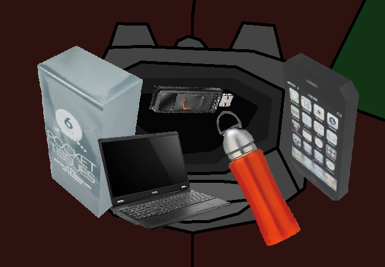

			<h1>Check inside bag</h1>
			
			
You set up a custom 3d model spinning gif of two objects before realising how annoying and difficult it would be to make them all 3d so you give up and use a bunch of stock images instead.

			
Anyways, you look in your bag...

			<h2>YOU HAVE:</h2>
			
1 PACKET OF TISSUES 1 CELLULAR DEVICE 1 WATER BOTTLE 1 PUTERTOP and 1 USB DRIVE

			
The USB DRIVE just has stuff you wanted to save, like photos or documents or whatever. You rarely use your CELLULAR DEVICE since your PUTERTOP is right there and it can do so much more than your CELLULAR DEVICE. The TISSUES are just a backup incase your allergies ever flair up or if anything spills. And the WATER BOTTLE is if you get a little thirsty during the day.

			
Of course you knew that already since this is your bag so you don't know why you felt the need to check it. Eh, you can never be too careful.

			<a href="?p=0016"><h2>> Check fridge</h2><a>
			
			

				<a href="?p=0014">Previous Page</a>
				<h5>28/02</h5>
			

		