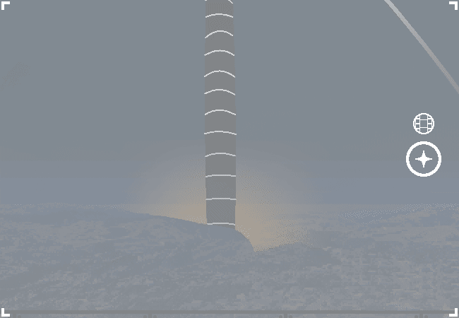

			<h1>Actually take the picture</h1>
			
			
You actually take the photo this time. Certainly one for the books, and by "books" you mean THE WEBOVERSE FORUMMMM!!!!!!!!!!

			
Actually, it isn't really space related??? It's just a nice photo but whatever you don't think it matters.

			<a href="?p=0020"><h2>> Go to bathroom and freshen up</h2><a>
			
			

				<a href="?p=0018">Previous Page</a>
				<h5>02/03</h5>
			

		