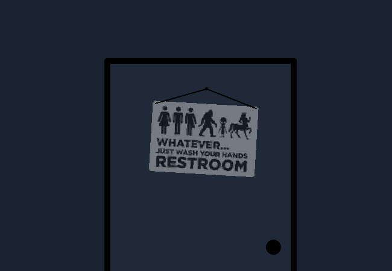

			<h1>Go to bathroom and freshen up</h1>
			
			
You go to the bathroom and refreshen up.

			
You are now freshed produce.

			<a href="?p=0021"><h2>> Get ready to go</h2><a>
			
			

				<a href="?p=0019">Previous Page</a>
				<h5>03/03</h5>
			

		