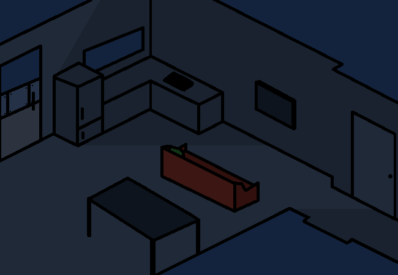

			<h1>Get ready to go</h1>
			
			
I love trying to blindly work with perspective. Also I had no idea what to put behind the couchfa so there's a random dining table with no chairs.

			
You gather your wallet and whatnot because it would be embarassing to get that far and not be able to even buy your breakfast.

			
You do this so fast that you don't even show up in the gif.

			
I CANNOT draw people properly so you don't get to see your own character design.

			<a href="?p=0022"><h2>> Now get that car upright and get the hell outta here!</h2><a>
			
			

				<a href="?p=0020">Previous Page</a>
				<h5>03/03</h5>
			

		