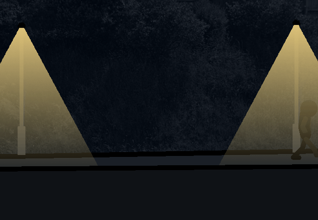

			<h1>==></h1>
			
			
You go through the not balcony door and step out onto the street.

			
The cool night air you felt 5 pages ago is still there. The dim road lit by old fluorescent street lamps light the path you'll take down to the shops. You're one of the only people on this side of the planet that's awake right now and you can tell by how quiet it is.

			
That person over there isn't you by the way, I mean everyone looks pretty similar, especially when it's really dark, but you're over here right now and not being over there.

			<a href="?p=0024"><h2>> Ride down the hill in a silly fashion</h2><a>
			
			

				<a href="?p=0022">Previous Page</a>
				<h5>03/03</h5>
			

		