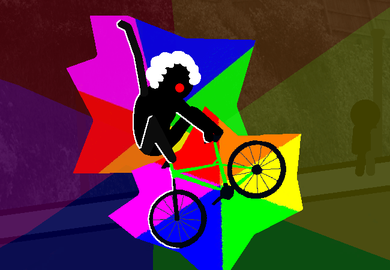

			<h1>Ride down the hill in a silly fashion</h1>
			
			
You ride down the hill in a silly fashion in silly fashion.

			
YEAHHHHHHHHHHHHHHHHHHHH!!!!!!!!!!

			
Actually that's probably less in a silly fashion and more TOTALLY RADICAL!!!!!! Still in somewhat silly fashion though.

			<a href="?p=0025"><h2>> ==></h2><a>
			
			

				<a href="?p=0023">Previous Page</a>
				<h5>06/03</h5>
			

		