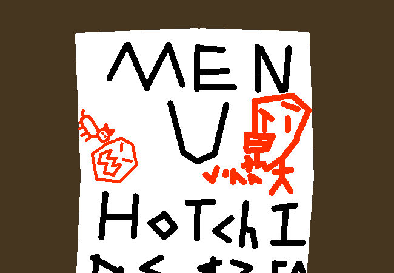

			<h1>Look at the menu please</h1>
			
			
<em>The men I please are no-</em>

			
You check the menu.

			<h2>THE MENU:</h2>
			
Hot Chips $2.50 Ham and Cheese Croissant $5.00 Tomato Soup $5.00 Gilled Chese -$5.00

			
And also a few other things you don't feel like- Hey wait, I think this has been vandalised. Okay, vandalism is a strong word but I think someone drew on it or something? These prices can't be right.

			
You will get a soder along with whatever else you purchase because you're thirsty again from all of those <em>SICK TRICKS!!!</em>

			<a href="?p=0029"><h2>> Get the hot chips and grilled cheese</h2><a>
			
			

				<a href="?p=0027">Previous Page</a>
				<h5>08/03</h5>
			

		