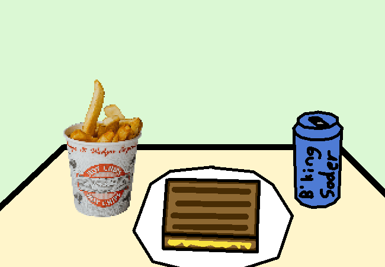

			<h1>Get the hot chips and grilled cheese</h1>
			
			
You get the hot chips and grilled cheese as well as a diet sparkling flavoured juice water thingy.

			
You check the receipt.

			<h2>RECEIPT:</h2>
			
Hot Chips: $2.50 Gilled Chese: -$5.00 Soder: $1.00  TOTAL COST: -$1.50

			
You gained $1.50 in your bank account when you paid for it??????

			
I mean, I'm not complaining. Just...  ???????????

			
Aw man, I could go for some hot chips right now, aauughhhhhh.

			<a href="?p=0030"><h2>> Eat the grill chezzboiurger and down the drink, save the chippie frize for train</h2><a>
			
			

				<a href="?p=0028">Previous Page</a>
				<h5>08/03</h5>
			

		