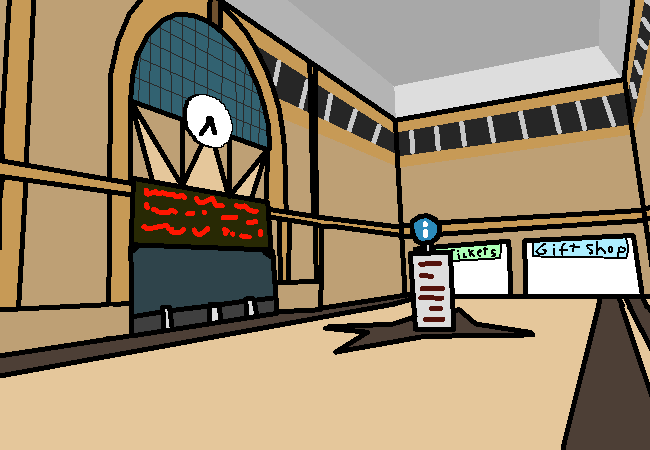

			<h1>Look around in the station</h1>
			
			
You walk into the main area of the train station. There isn't much, this place is built to handle a lot of people so it's just big and empty.  There is a gift shop though, also a ticket sales room? You don't need to buy a ticket anyways, you're already here. There's also an information kiosk or whatever in the middle of the room too?

			<a href="?p=0037"><h2>> Go to information kiosk</h2><a>
			
			

				<a href="?p=0035">Previous Page</a>
				<h5>14/03</h5>
			

		