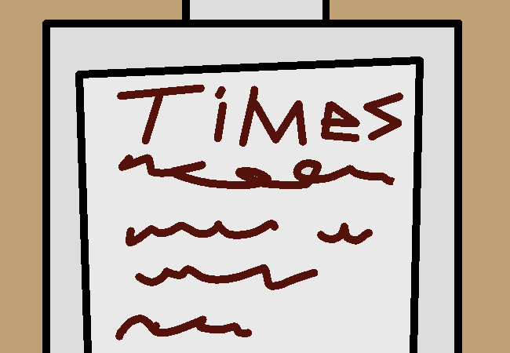

			<h1>Go to information kiosk</h1>
			
			
You walk over to the information kiosk. It cycles through regular train times like a screen saver but also includes a touch screen for other bits of information.

			
You can pick between "!#$&%*@ Station General Info", "!#$&%*@ Station History", "!#$&%*@ City History", "Available suburbs and planned suburbs"

			
Some of these are probably uninteresting but you can read them all anyways if you want to.

			<a href="?p=0038"><h2>> Read City History</h2><a>
			
			

				<a href="?p=0036">Previous Page</a>
				<h5>14/03</h5>
			

		