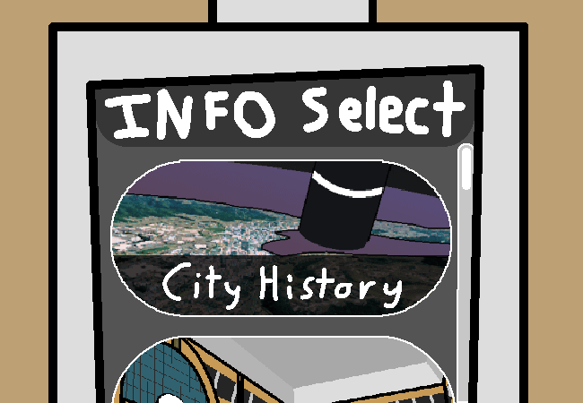

			<h1>Read City History</h1>
			
			
Well those certainly are words of possible wisdom and certainly aren't words of impossible stupidity.

			
You open the City History page and get reading.

			

				
Open City History Page

				
As with many other cities built all around the globe, !#$&%*@ was constructed around the nearby connection spire, allowing for extremely cheap energy distribution throughout the city. Due to this easy energy, citizens swarmed here and started building the biggest city in the region. The city now serves as it's own connection point, not only connecting the nearby suburbs, but it is also joined to the main rail line connecting many other major cities together. Not much is known about this city's birth, aside from the fact that it was one of the first to use power from the connection spires.  Fun Fact: Connection Spires originally had no official name, but the people living in this very city came up with a name themselves, and it spread to the rest of the world. Despite not holding up to the correct definition for the word "spire" (Put simply, being something that gets smaller or thinner at one end), they presumably first named it that because of how the top is further away and therefore looks smaller than the base. The true origin of the title is unfortunately unknown.  This is is a small information station to serve as an introduction to the city for tourists or people new to the region. For more information, check the station's website at: www.!#$&%*@.station.com

			

			

			<a href="?p=0039"><h2>> Read Station History next</h2><a>
			
			

				<a href="?p=0037">Previous Page</a>
				<h5>15/03</h5>
			

		