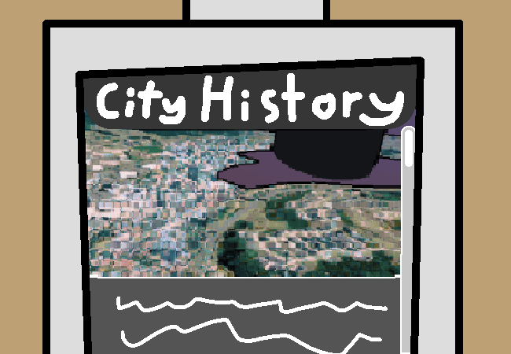

			<h1>Read Station History next</h1>
			
			
Okay, not much history in that last page at all... It's just like... Advertisement buzzwords more than anything? They basically just said "It's big and it has a station in it". That was useless, but you decide to keep reading anyways. You open the station history page.

			

				
Open Station History Page

				
The !#$&%*@ City Station was built decades ago but has seen many changes and has been revamped a lot over the course of time. The station began as a small building with a simple railway connecting to a nearby suburb, back when the city was first being built. Merely a train to transport construction materials. Slowly, over many, many years, the station grew in popularity, more tracks were hooked up and now it is the main train hub for the region.  Fun Fact: The station's signature design has always existed throughout every single iteration of the building. Even in the designs that were not greenlit!  This is is a small information station to serve as an introduction to the city for tourists or people new to the region. For more information, check the station's website at: www.!#$&%*@.station.com

			

			
A nothing notherburger. Another burger noth...

			
Well, it doesn't hurt to read random facts in a pretty much empty train station at like 5:40 in the morning.

			
Wanna keep going?

			<a href="?p=0040"><h2>Yeah ></h2><a>
			
			

				<a href="?p=0038">Previous Page</a>
				<h5>16/03</h5>
			

		