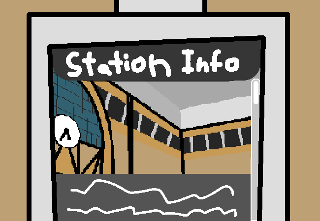

			<h1>==></h1>
			
			
You switch to the General Station Info page.

			

				
Open Station Info Page

				
The station doesn't actually have a name, it's just referred to as the city station. It has been in operation for many decades, transporting citizens from place to place. Suburb to suburb, city to city. With trains arriving and departing every few minutes at peak times. It is the biggest and busiest station in the region, it even surpasses some of the bigger city stations in other regions.  This is is a small information station to serve as an introduction to the city for tourists or people new to the region. For more information, check the station's website at: www.!#$&%*@.station.com

			

			

			<a href="?p=0042"><h2>> And finally...</h2><a>
			
			

				<a href="?p=0040">Previous Page</a>
				<h5>17/03</h5>
			

		