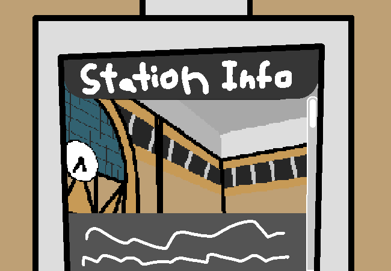

			<h1>And finally</h1>
			
			
You finally switch to the last page, the Available Suburbs and Planned Suburbs page.

			

				
Open ASAPS Page

				
%&*!$^&*@!(@!#^!@$&*!@^#&@*$^*(!@&$!^@#&^!@$&*!@%^*&!%!@*)!&@%)@!*($&!@)($&!@(&%^!@(*$&!@^L!&@*$^@!*$&^!@4y!@&*$$Y*&!@^!&$*(!FH@$!@Y$&!@$@!Y$&*@!$!@)$!$!@^$&*!)$!@)$!@$@!)!@$!@&$*!D&*$!@D$D!@$DS!Y$^G&$%!@&^#*!@#(@!$^&!@$@^!#*&!@(#@(!#@!))!@#^&*!@)#!@&#)!*@#!@*#!(*#!@*#!@#)!@#!)@#!@!@*#132816@*&$^!@&*$!^@$!@##&(*!@#!^@*$&!@$^!@%*@!)!^@$&*!@^$&*!@%!^@*!&%!4(!#^!@#&@$&*$^&*$^%&#*#*@^&*^!@#!&*%$&*@#(%&*@#^!&*$^(@&#!#@^&%*^&*(&%*$^$&.  This is is a small information station to serve as an introduction to the city for tourists or people new to the region. For more information, check the station's website at: www.!#$&%*@.station.com

			

			
Well idk what I expected, it lists a ton of names of places that we'll never see nor any that will ever be relavant. I think this page is just here to add space so the info thingy doesn't just feel empty. Although I failed to realise that I didn't actually have much to say right now when I listed the available pages originally.

			<a href="?p=0043"><h2>> Get the show on the road!!!</h2><a>
			
			

				<a href="?p=0041">Previous Page</a>
				<h5>17/03</h5>
			

		