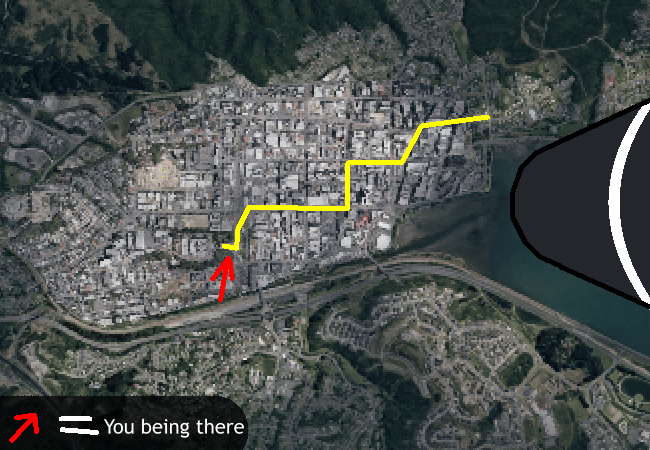

			<h1>Get going</h1>
			
			
You get going, zippity zooping around the city to the meeting place.

			<a href="?p=0046"><h2>> ==></h2><a>
			
			

				<a href="?p=0044">Previous Page</a>
				<h5>18/03</h5>
			

		