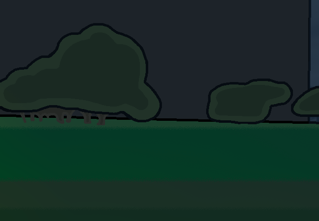

			<h1>==></h1>
			
			
Okay you're here, at the meeting place. Damn, you forgot how big the spires are in person.

			
You wonder where the guy you were meeting with is... Actually you don't even know what he looks like.

			<a href="?p=0047"><h2>> Check Weboverse</h2><a>
			
			

				<a href="?p=0045">Previous Page</a>
				<h5>18/03</h5>
			

		