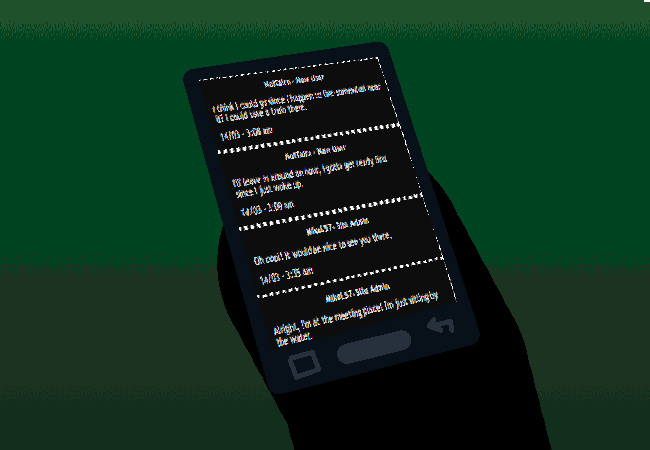

			<h1>Check Weboverse</h1>
			
			
There's no wifi here so you break out the DATA!!!!

			
You check the Weboverse forum and open the Off-Topic thread.

			

				
Open New Messages

				

					

						<h3>NotTairo - New User</h3>
						
I think I could go since I happen to live somewhat near it? I could take a train there.

						
14/03 - 3:08 am

					

					

						<h3>NotTairo - New User</h3>
						
I'll leave in around an hour, I gotta get ready first since I just woke up.

						
14/03 - 3:09 am

					

					

						<h3>MikeL57- Site Admin</h3>
						
Oh cool! It would be nice to see you there.

						
14/03 - 3:35 am

					

					

						<h3>MikeL57- Site Admin</h3>
						
Alright, I'm at the meeting place! I'm just sitting by the water.

						
14/03 - 5:34 am

					

				

			

			
Oh yeah, two new messages at the bottom.

			<a href="?p=0048"><h2>> Check by the water</h2><a>
			
			

				<a href="?p=0046">Previous Page</a>
				<h5>19/03</h5>
			

		