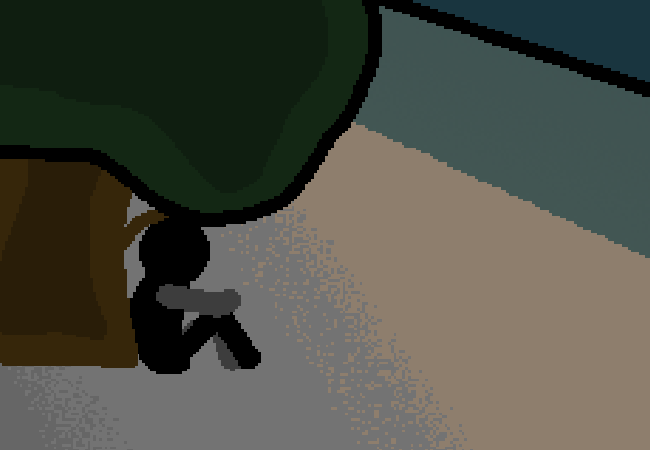

			<h1>Greet them</h1>
			
			
You go up to them and greet them.

			

				
Open Chat Log

				

					

						<h3>You</h3>
						
Uhm... Hello? Are you Mike?

						
14/03 - 5:56 am

					

					

						<h3>Mike???</h3>
						
Oh, wow. Uh, yeah! I'm Mike. Are you the person from the forum?

						
14/03 - 5:56 am

					

					

						<h3>You</h3>
						
Yeah. "NotTairo". ...If that's who you're talking about.

						
14/03 - 5:56 am

					

					

						<h3>You</h3>
						
My actual name is Mei.

						
14/03 - 5:57 am

					

					

						<h3>Mike</h3>
						
Well, nice to meet you Mei... Did you know if anyone else was coming? I mean I don't think so but, just in case.

						
14/03 - 5:57 am

					

					

						<h3>You</h3>
						
Uhh no, I don't think so?

						
14/03 - 5:57 am

					

					

						<h3>Mike</h3>
						
Then, uhh. We could probably get moving! Unless there's anything else you need to do first?

						
14/03 - 5:57 am

					

				

			

			
Do you have something you need to do first? Genuine question, we can go already if you want.

			<a href="?p=0050"><h2>> Celebrate 50 Pages</h2><a>
			
			

				<a href="?p=0048">Previous Page</a>
				<h5>19/03</h5>
			

		