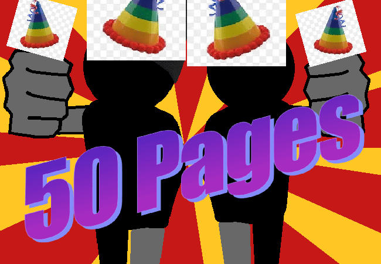

			<h1>Celebrate 50 Pages</h1>
			
			
Woohoo!!! This story is NOT over in like 50 pages!!! All for da medium-ish-ly long haul!!!!

			<a href="?p=0051"><h2>> Wait until 6am just in case</h2><a>
			
			

				<a href="?p=0049">Previous Page</a>
				<h5>20/03</h5>
			

		