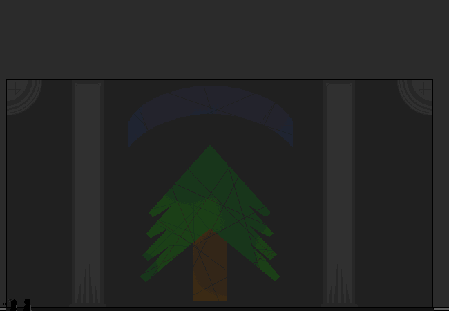

			<h1>==></h1>
			
			
Why does it need to be this big?????

			
The sizes are based off an old 3d project so the door was made to look cool in a first person game, but in comparison to an actual person it seems far too big.

			<a href="?p=0056"><h2>> ==></h2><a>
			
			

				<a href="?p=0054">Previous Page</a>
				<h5>21/03</h5>
			

		