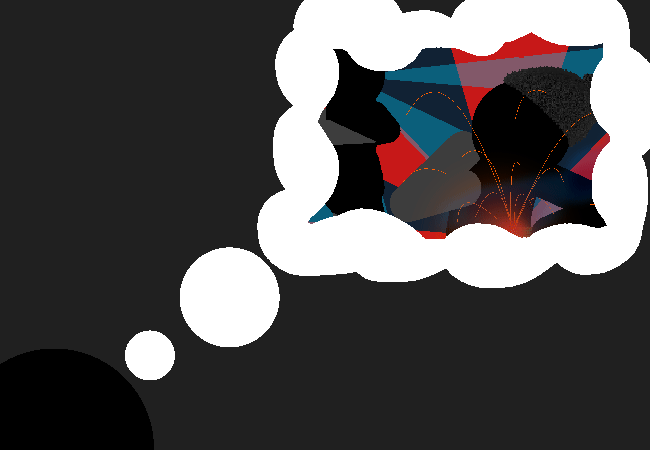

			<h1>==></h1>
			
			
He can't... uh...

			

				
Open Chat Log

				

					

						<h3>Mike</h3>
						
Hey? Are you... good??

						
14/03 - 6:07 am

					

			

			<a href="?p=0059"><h2>> ==>	</h2><a>
			
			

				<a href="?p=0057">Previous Page</a>
				<h5>22/03</h5>
			

		