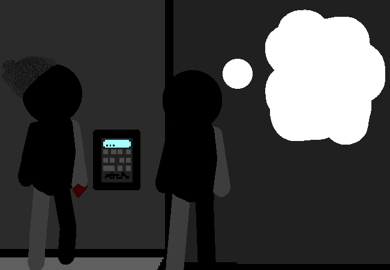

			<h1>==></h1>
			
			
Sorry...

			

				
Open Chat Log

				

					

						<h3>You</h3>
						
Wh- huh? Oh. Sorry...

						
14/03 - 6:07 am

					

					

						<h3>You</h3>
						
I just spaced out for a second there...

						
14/03 - 6:07 am

					

					

						<h3>Mike</h3>
						
It's alright! I do it too sometimes.

						
14/03 - 6:08 am

					

					

						<h3>Mike</h3>
						
Anyways, I was gonna say that the panel has something written at the bottom.

						
14/03 - 6:08 am

					

					

						<h3>Mike</h3>
						
It says we gotta go to the front reception for the code.

						
14/03 - 6:08 am

					

			

			<a href="?p=0060"><h2>> Go find the reception</h2><a>
			
			

				<a href="?p=0058">Previous Page</a>
				<h5>22/03</h5>
			

		