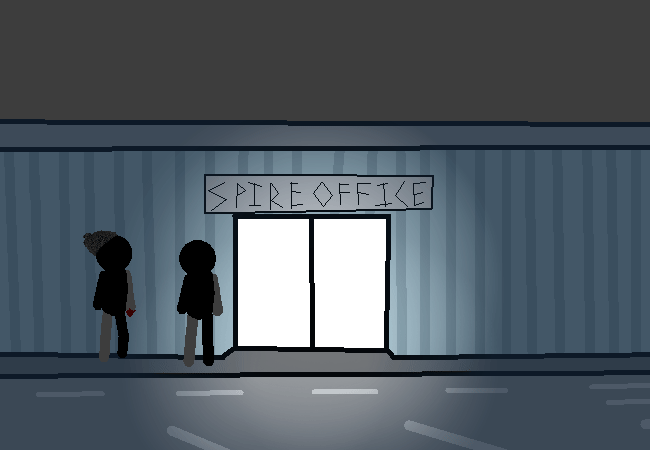

			<h1>==></h1>
			
			

			

				
Open Chat Log

				

					

						<h3>You</h3>
						
Okay, so are we going with the journalist thing?

						
14/03 - 6:09 am

					

					

						<h3>Mike</h3>
						
Yeah... Maybe you could pretend you have some camera equipment in your bag???

						
14/03 - 6:09 am

					

					

						<h3>Mike</h3>
						
Well, you don't have to but... It's just like an extra layer to the... roleplay????

						
14/03 - 6:09 am

					

					

						<h3>Mike</h3>
						
Hey, where's your bike by the way?

						
14/03 - 6:09 am

					

					

						<h3>You</h3>
						
Uhhhhhhhhhhhhhhhhhhhhhhhhhhhh............

						
14/03 - 6:10 am

					

					

						<h3>You</h3>
						
.... It... just... does that sometimes???? Like.... Goes non-existent for a bit???

						
14/03 - 6:10 am

					

				

			

			<a href="?p=0062"><h2>> Do an action packed planning scene</h2><a>
			
			

				<a href="?p=0060">Previous Page</a>
				<h5>22/03</h5>
			

		