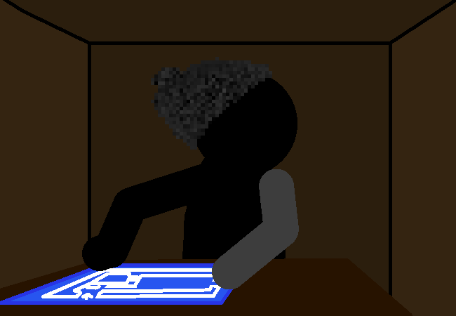

			<h1>Do an action packed planning scene</h1>
			
			

			

				
Open Chat Log

				

					

						<h3>Mike</h3>
						
Alright. Let's go over the plan...

						
14/03 - 6:10 am

					

				

			

			<a href="?p=0063"><h2>> ==></h2><a>
			
			

				<a href="?p=0061">Previous Page</a>
				<h5>22/03</h5>
			

		