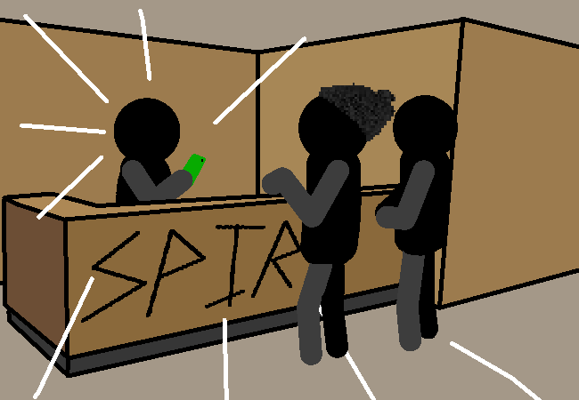

			<h1>==></h1>
			
			

			

				
Open Chat Log

				

					

						<h3>Mike</h3>
						
Step 3: Talk to the guy at reception. State that we are journalists and we're here to document the functionality of the connection spires.

						
14/03 - 6:10 am

					

				

			

			<a href="?p=0066"><h2>> ==></h2><a>
			
			

				<a href="?p=0064">Previous Page</a>
				<h5>22/03</h5>
			

		