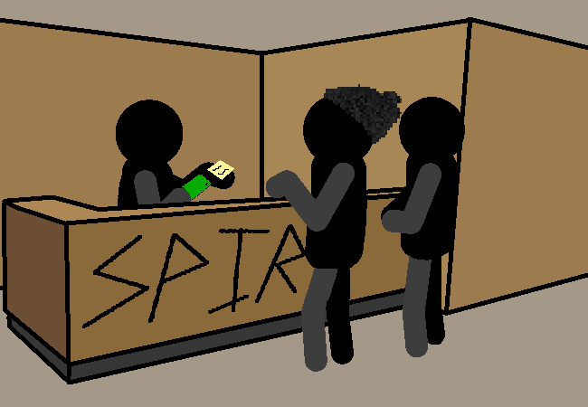

			<h1>==></h1>
			
			

			

				
Open Chat Log

				

					

						<h3>Mike</h3>
						
Uhhhhh, hey. We're journalists and we are doing a... like a... documentary of sorts... on how connection spires work...

						
14/03 - 6:11 am

					

					

						<h3>Mike</h3>
						
I know it's been done before but, the company ran out of ideas so they are just making us do this for now.

						
14/03 - 6:11 am

					

					

						<h3>Mike</h3>
						
So we need the uh... The thing- The code, for the... door...

						
14/03 - 6:11 am

					

					

						<h3>Reception guy</h3>
						
......

						
14/03 - 6:11 am

					

					

						<h3>Reception guy</h3>
						
............

						
14/03 - 6:11 am

					

					

						<h3>Reception guy</h3>
						
Sure, whatever. I don't feel like dealing with another customer support session to check if you're telling the truth.

						
14/03 - 6:11 am

					

					

						<h3>Reception guy</h3>
						
Here, just don't break anything.

						
14/03 - 6:11 am

					

					

						<h3>Mike</h3>
						
Thank you!

						
14/03 - 6:11 am

					

					

						<h3>Reception guy</h3>
						
..... (Why was that person still in their jammies???)

						
14/03 - 6:12 am

					

				

			

			<h2>YOU HAVE OBTAINED:</h2>
			
1 sticky note with the code on it.

			<a href="?p=0067"><h2>> ==></h2><a>
			
			

				<a href="?p=0065">Previous Page</a>
				<h5>22/03</h5>
			

		