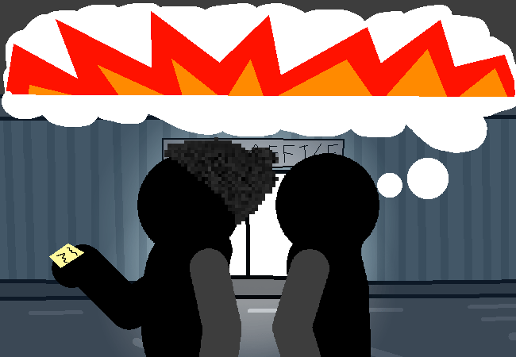

			<h1>==></h1>
			
			

			

				
Open Chat Log

				

					

						<h3>Mike</h3>
						
Step 4: Leave in style.

						
14/03 - 6:12 am

					

				

			

			
Okayyyyy.....

			
Uhhhhhhhhhh... You have the code now...

			<a href="?p=0068"><h2>> Go back to the door of importantness</h2><a>
			
			

				<a href="?p=0066">Previous Page</a>
				<h5>22/03</h5>
			

		