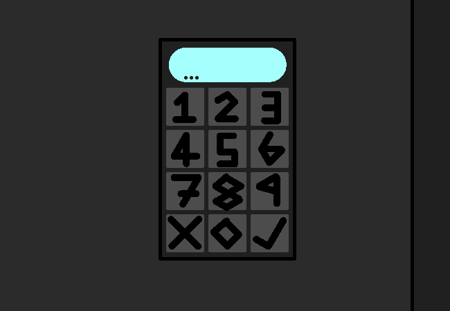

			<h1>Input funny and irrelevant numbers</h1>
			
			
Okie... Such as?

			
"Uhh Put 1997 and 1987 Oh and 1983 while they're at it Never know when it could turn into an arg"

			
spamtonipliercawthon

			
You input the spamtonia one on screen and the other two off screen because I don't feel like animating it right now.

			
They output the messages: "Kromer" "WASTHAT" "BITEOF"

			
Why did they feel the need to add meme responses to the security panel?????

			
 ... You feel like you should probably just input the actual code you got instead of messing with the security panel.

			<a href="?p=0070"><h2>> Put 1234 just to be extra extra sure</h2><a>
			
			

				<a href="?p=0068">Previous Page</a>
				<h5>25/03</h5>
			

		