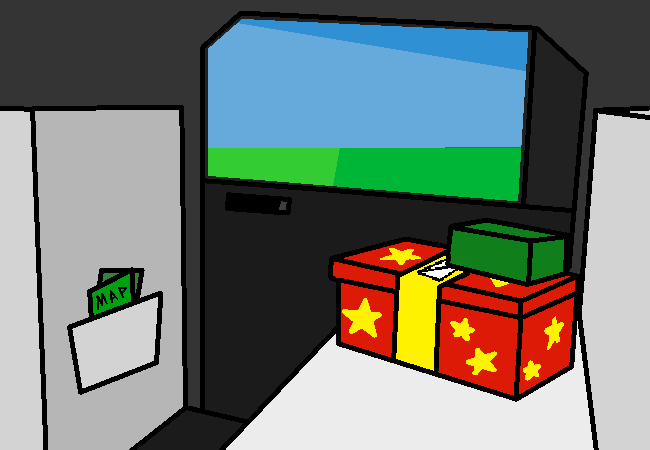

<h1>Look around</h1>

You look around. You're in the back seat of your car, and you're traveling somewhere with your family. There are birthday presents in the other seat across from you.

...

The temptation is too real. Because they're right next to you. And man you... You REALLY wanna open them. But you shouldn't, because it's not cool, but... IT'D BE FUNNN......

There's also a map brochure thingy your dad got of the place you're going. Just sticking out of the back of the seat pocket thing. That could be a way to get <em>your</em> bearings, not your bearings but <em>your</em> bearings (in italics).

<a href="?p=0074"><h2>> Look outside window</h2></a>

	<a href="?p=0072">Previous Page</a>
	<h5>06/04</h5>

		