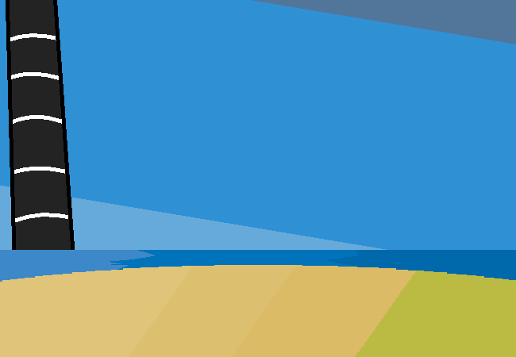

<h1>Look outside window</h1>

You look out the window again. You're sorta close to the ocean, you can see the water from here but it would take a bit of time to get there. There are a ton of farms or whatever in between you and the ocean. Also there's a connection spire sorta back that ways and out in the middle of the water because you can't really go anywhere without one of those looking all big and cylindrical in the distance.

You can't really get a good look out the window on the other side of the car but it's mainly just farms and grass for as far as you can see.

Yes I'm gonna keep using these background assets from the flash because I don't wanna make new ones. Medium-ish-ly long haul, not extremely long haul.. After RAD I can never look at "haul" the same way ever again.

<a href="?p=0075"><h2>> Check the flier thingy</h2></a>

	<a href="?p=0073">Previous Page</a>
	<h5>06/04</h5>

		