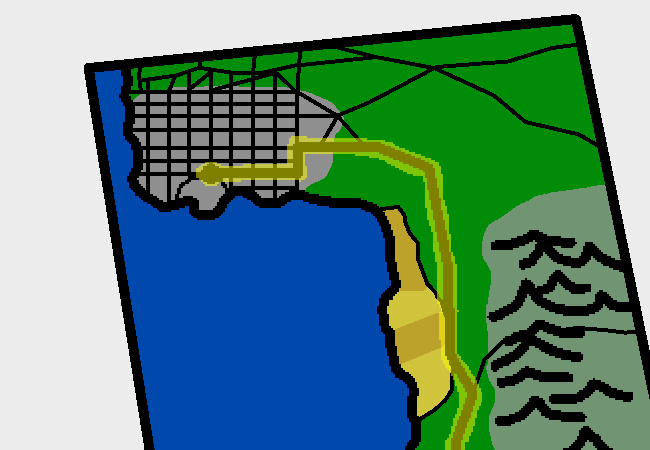

<h1>Check the flier thingy</h1>

You check the map pamphlet broacher floater piece of paper with colourful ink on it.

It isn't a professional advertisement map thing you bought anywhere, it's just a printed piece of paper with a map of the local area around the campsite you'll be staying at (Which is what's marked) on it. You aren't doing a whole tent ordeal or anything, just getting a cabin and staying there. The road you're currently on is marked with a yellow highlighter as well.

I realise the map's shape looks a bit like Africa, but it isn't.

<a href="?p=0076"><h2>> Look at the label on the gifts</h2></a>

	<a href="?p=0074">Previous Page</a>
	<h5>07/04</h5>

		