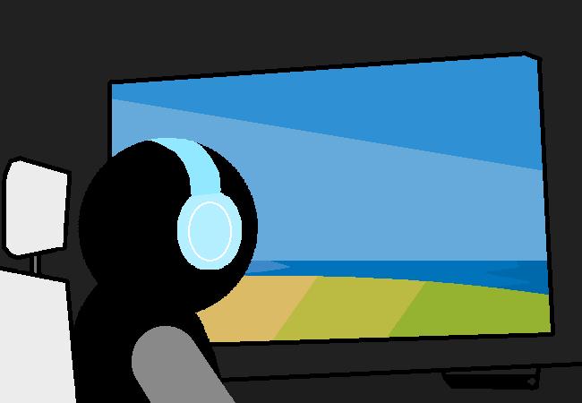

<h1>Hit play on shouph-lay and look outside window like pretty much every protagonist ever</h1>

Sh- shouph-lay...? ... oohhhhhhhhh.... shuffle....

You look outside the window and listen to your shuffling music like a protagonist would do in some poorly made webcomic or something. Said poorly made webcomic also probably re-used this shot from earlier and slightly edited it to do less work.

<a href="?p=0079"><h2>> [S] ==></h2></a>

	<a href="?p=0077">Previous Page</a>
	<h5>10/04</h5>

		