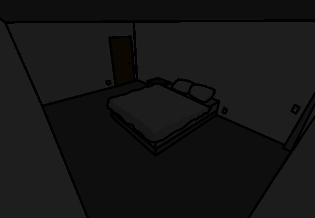

<h1>Step inside</h1>

The inside has been stepped. You also turn on the light.

The room is pretty empty, enough space to put all the stuff you brought. There's a bed and nightstand, and some door at the other end of the room that probably leads to more bedding. There's also a TV in the top corner of the room, near the door, and a remote on the nightstand.

<a href="?p=0083"><h2>> Haul the stuff in</h2></a>

	<a href="?p=0081">Previous Page</a>
	<h5>11/04</h5>

		