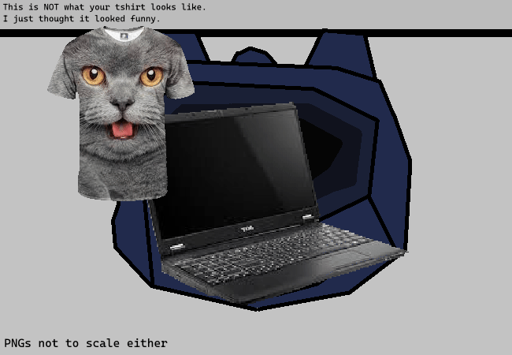

<h1>Unpack</h1>

You unpack your bag.

<h2>YOU HAVE UNPACKED:</h2>

~ This joke again. ~ An alternate version of the panel on page 15 ~ 1 Laptop and... nooo charger cableeee.... ........ oops... ~ The rest is... ~ Uhhhh, mainly clothes. ~ Like underwear... ~ 2 t-shirts and 2 pairs of pants. ~ Two have fun cats on them, and two don't. ~ And a hoodie... That you're already wearing... ~ It's actually space themed, cool planets and stars and stuff. ~ Yeah, you didn't really bring much. ~ It's just clothes for like a couple days of staying here. ~ Most of the stuff you do is confined to your laptop anyways. ~ Your laptop, which... doesn't have power... ~ The battery ran out and you forgot... ~ This is going to be a long next couple of days.... ~ Why am I still writing in this wa- ~ I just realised I could have made a reference there but I didn't!!!! ~ NOOOOOOOOOO!!!!! ~ Uhhh, uhhhhhh ~ You have a feeling it's... no... ~ It's too late now... ~ Eh, whatever. ~ What were you supposed to be doing again?? ~ .... ~ Hey, y- sorry

Hey, you think you just heard your parents call for you in the other room?

<!--<a href="?p=0087"><h2>> </h2></a>-->

	<a href="?p=0085">Previous Page</a>
	<h5>13/04</h5>

		