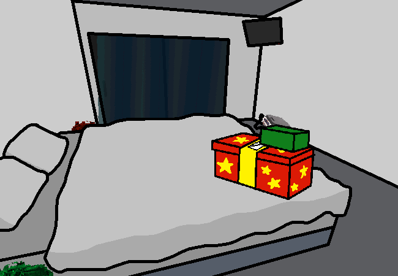

<h1>Go to parents</h1>

You go into the other room and... You think you know what's going on here. Presents in view, something important your parents are calling you in for, it's your birthday and we are at the birthday location, we're done with unpacking...

Your parents walked over next to you as well. <ye id="oops">Out of frame so I don't have to draw them.</ye>

<a href="?p=0088"><h2>> Presents time!!!</h2></a>

	<a href="?p=0086">Previous Page</a>
	<h5>14/04</h5>

		