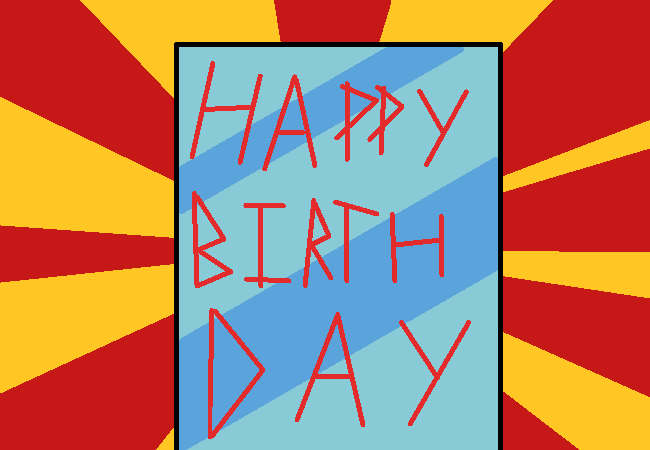

<h1>Open the letter</h1>

You open the card filled with plenty of letters from the English alphabet, and also FIFTY DOLLARINOES!?!?!?!???? Wow. You actually read the card, it says:

	
Open Forum Thread

	
To Nova.

	
The big 18! You're a fully grown adult now, we know it can be scary moving into the big wide world, but you'll always have us to support you. Your future is up for you to decide, whatever path you want to take in life. But for now, enjoy your presents, and have a wonderful birthday!!!

	
Love from Mum and Dad &#9829;

And then there's a little doodle of a cake at the bottom of the page.

Awwwww

<a href="?p=0090"><h2>> Open the small gift</h2></a>

	<a href="?p=0088">Previous Page</a>
	<h5>14/04</h5>

		