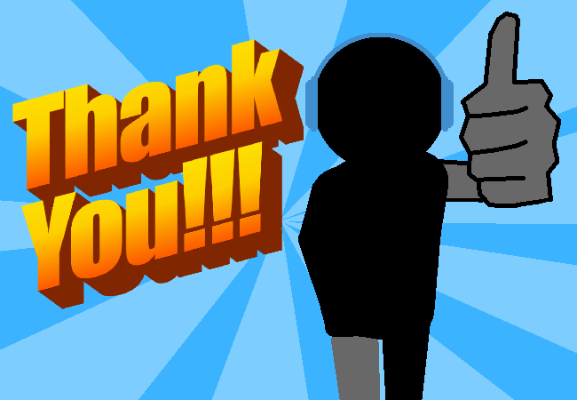

<h1>Thankies the Parenties</h1>

You thank them and hug them and have a nice family moment, as I use this panel again to avoid drawing more characters doing mildly complex poses.

<a href="?p=0098"><h2>> Check phone battery</h2></a>

	<a href="?p=0096">Previous Page</a>
	<h5>14/04</h5>

		