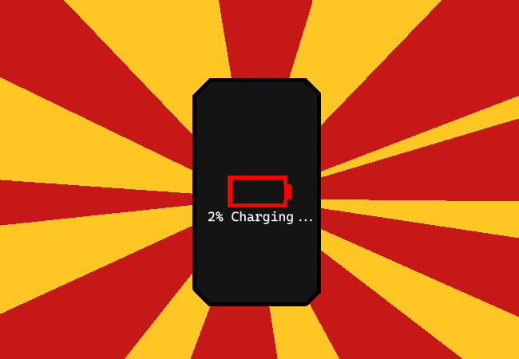

<h1>Check phone battery</h1>

It's at 2% already, you keep it plugged in.

You could probably turn it on and check Weboverse now if you wanted. You probably can't chat or anything right now though since it looks like your parents are setting up dinner and you might need to leave abruptly. But you guess it would be good to just check what's been going on and to confirm which user you are on there for those reading who haven't figured it out yet?

<a href="?p=0099"><h2>> Go and wait at dinner table like a good kid</h2></a>

	<a href="?p=0097">Previous Page</a>
	<h5>14/04</h5>

		