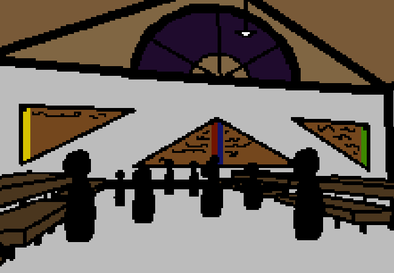

<h1>Go look at those cool looking colored signs</h1>

You aren't going to trap yourself in that crowd but you can read the signs from over here, so you do that.

They are... a whole lot less cool than you were apparently led to believe, though...

Each colour represents a house for some like, group thing? This campground may be used for something like that and this could be a meeting hall for the teams? They mainly just list people's names and a year for each name.

Oh hey, your parents are back again and they're asking you what you want for dinner since it's your birthday. You can pick literally anything (That isn't impossible to get or extremely expensive.)

<!--<a href="?p=0102"><h2>> </h2></a>-->

	<a href="?p=0100">Previous Page</a>
	<h5>16/04</h5>

		