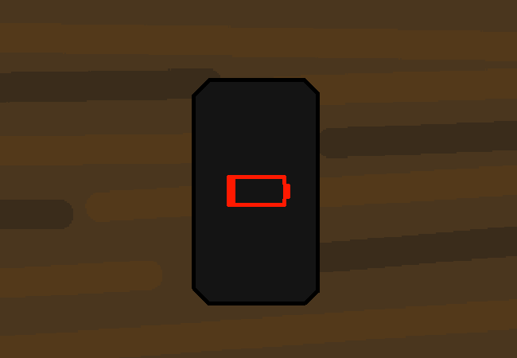

<h1>Czech the phone</h1>

Nice word pronounciation joke :)

Lol, anyways you set the phone language to cze-

<a href="?p=0104"><h2>> ==></h2></a>

	<a href="?p=0102">Previous Page</a>
	<h5>21/04</h5>

		