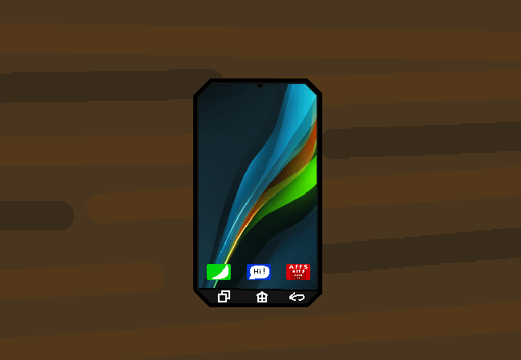

<h1>Czech the phone</h1>

You actually just turn it on, the battery is a bit... more... higher. You have more battery charge in the phone. It opens to the home screen, the wallpaper is pretty generic, you could change it if you want? It's got clicky light up buttons at the bottom. The basic apps that let you call and text and install new apps are there, although you probably have no one to call or text right now.

Aside from that, there's nothing else immediately popping out at you.

<a href="?p=0105"><h2>> Head onto the verse of webs</h2></a>

	<a href="?p=0103">Previous Page</a>
	<h5>21/04</h5>

		