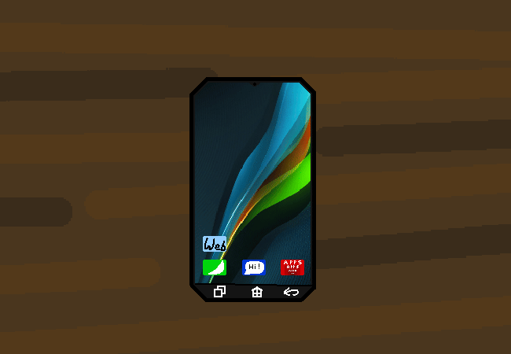

<h1>Head onto the verse of webs</h1>

You download a browser and open the universal web. Well, planet wide, universal depth web, with the height of a device screen.

<a href="?p=0106"><h2>> ==></h2></a>

	<a href="?p=0104">Previous Page</a>
	<h5>25/04</h5>

		