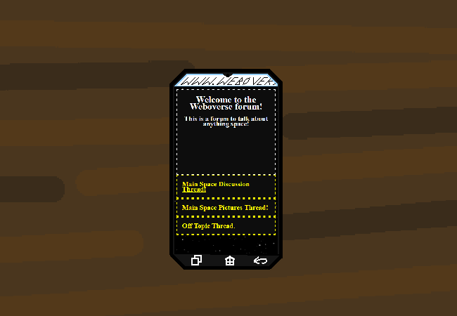

<h1>==></h1>

What would you to see my monarch?

Optionaroonies. Read 'em and see... p

<a href="?p=0107"><h2>> Open the main discussion thread</h2></a>

	<a href="?p=0105">Previous Page</a>
	<h5>25/04</h5>

		