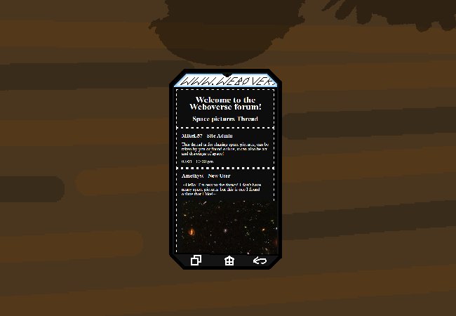

<h1>Open the pictures thread</h1>

You open the pictures thread and there's nothing new yet. Hey look there's your accidentally really big image.

Also your food's here now.

<a href="?p=0109"><h2>> Check the last fourm section of the site</h2></a>

	<a href="?p=0107">Previous Page</a>
	<h5>26/04</h5>

		