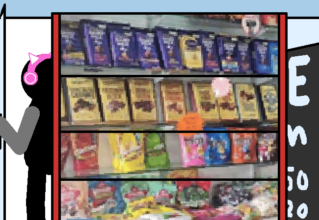

<h1>Look at the snackies</h1>

You got ALL the different flavours in here. Got da popato chisps, got da gummy lollies, both sour and not. Got da hard candies which are INFINITELY BETTER than chewing gum since you can actually swallow it 'cause it's not made of PLASTIC and it never ONCE got stuck on your or anyone else's shoes, or on... anything really, BECAUSE YOU CAN ACTUALLY EAT IT, IT ISN'T FLAVOURED PLASTIC LITTER THAT GETS EVERYWHERE!!!!!!!!!

You have had so many instances of accidentally touching the underside of a school desk and instead of it being wood, it's some gross squishy substance. You despise gum after dealing with that for HOW LONG NOW???

Okay... Sorry for getting loud for a second there.

They also gots da choccy! AND they even have those cookies in those packets, waawww!!

They're gonna be SO mad when they notice that the shelves are at slightly different distances from each other. Or that the png I used is innacurate to the items and order described, however less so that the first issue I listed.

<!--<a href="?p=0116"><h2>> </h2></a>-->

	<a href="?p=0114">Previous Page</a>
	<h5>09/05</h5>

