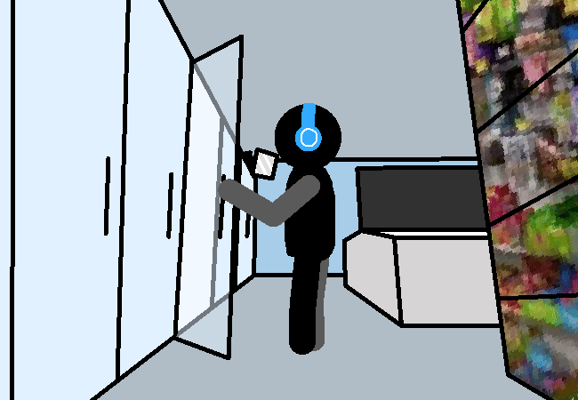

<h1>Collect the actual stuff we need</h1>

The actual stuff you need is just milk for now, y'know for breakfast in the morning.

<a href="?p=0118"><h2>> ==></h2></a>

	<a href="?p=0116">Previous Page</a>
	<h5>09/05</h5>

