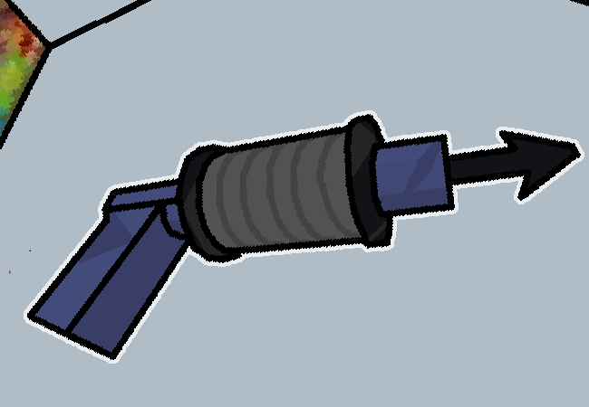

<h1>==></h1>

It kinda looks like that one weapon Medic TF2 has, although instead of syringes it's just rope.

But it's not like normal rope, like some metal variant that's flexible enough to coil around like that and presumably get shot out really fast.

It's got some hook on the front...

It looks pretty bashed up though, despite however the drawings may depict it, the drawings probably just made it look cooler somehow but it does indeed seem like it has gone on some long journey where it got hit around many times or something. It would probably fall apart if you dropped it any more times than it probably already has. That isn't foreshadowing btw it's just pretty damaged.

It's probably better if you don't just leave it on the ground at the back of some store though, and it's cool lookin' too, and the probable owner seems to have vanished into thin air so you might as well take it??

The pixels get fuzzy when I scale and rotate low res images, I could probably use that later for some cool style thing or something. Maybe even now... Quickly! Pretend this was intentional and think that the fuzzy pixels on this panel are intentionally there to make it look damaged!!!

<a href="?p=0123"><h2>> Captchalog into Sylladex</h2></a>

	<a href="?p=0121">Previous Page</a>
	<h5>09/05</h5>

